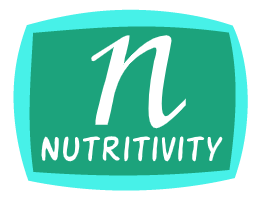

#    &nbsp; &nbsp; &nbsp; &nbsp; &nbsp; &nbsp; 

## &nbsp; &nbsp; &nbsp;The best value and quality of food

**Oftentimes, we hear the phrase "eat healthy". But what does healthy look like?**
Nutritivity is here to show you. It's the perfect all-around program to keep track of
and improve your diet. It tracks calories and all the major macro/micro nutrients. It also keeps track of food prices in relation to their
nutritive value - great for anyone on a budget. 

Nutritive value considers factors such as: 
 - calories
 - proteins 
 - vitamins 
 - even your preferences in taste!
 
 After as little as just a week of tracking, this program will offer useful insights you can use to upgrade your diet
 and lifestyle. So, you won't need to track your diet for months to see results. One week of tracking, and then you're free
 to implement the advice with or without the program. As such, Nutritivity is great for anyone just starting out with diet
 and fitness, as well as students on a budget, athletes tracking their calories, and food lovers around the world.
 
I'm very passionate about this project because while I've been trying to build a *healthy* diet I've found it very 
difficult to keep track of all the factors that make up the term *healthy*. I also wish there was a program that would analyze my 
food for me and show statistics such as what foods I'm wasting money on, what foods are the most beneficial, and how 
good my overall diet is.